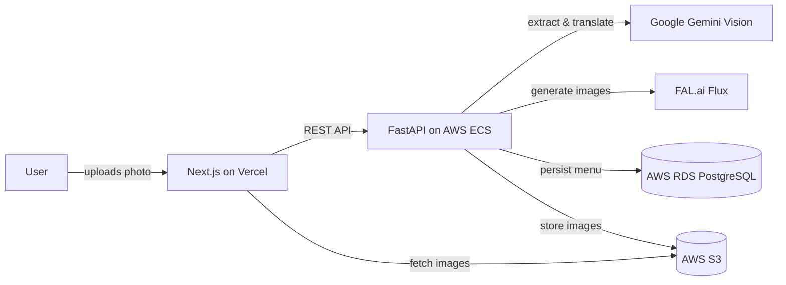

# MenuMind

> AI-powered menu visualization & translation — photograph any restaurant menu and instantly see a photorealistic image of every dish plus a bilingual translation.

**Live demo:** https://menu-mind-tawny.vercel.app

Traveling abroad, you open a menu and recognize nothing. MenuMind lets you photograph any restaurant menu and instantly see every dish — translated into English and rendered as a photorealistic AI image — so you actually know what you're about to order.

## Tech stack

**Backend**
- FastAPI (Python), async SQLAlchemy
- PostgreSQL, Alembic migrations
- Containerized with Docker, deployed on AWS ECS

**AI**
- Google Gemini 2.5 Flash — vision LLM for menu extraction and translation
- FAL.ai Flux Schnell — diffusion model for dish image generation

**Frontend**
- Next.js 15, React 19, TypeScript
- Tailwind CSS, shadcn/ui
- Deployed on Vercel

**AWS infrastructure**
- ECS — backend compute
- RDS PostgreSQL — database
- S3 — image storage
- ECR — container registry

## Architecture

