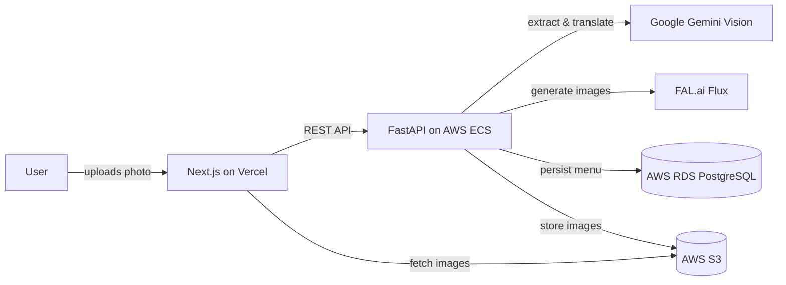

# MenuMind

> AI-powered menu visualization & translation — photograph any restaurant menu and instantly see a photorealistic image of every dish plus an English translation.

**Get the app:** [Google Play](https://play.google.com/store/apps/details?id=com.menumind.mobile&pcampaignid=web_share) · [App Store](https://apps.apple.com/de/app/menumind-menu-translator/id6795102776?l=en-GB)

**Live demo:** https://menu-mind-tawny.vercel.app

Traveling abroad, you open a menu and recognize nothing. MenuMind lets you photograph any restaurant menu and instantly see every dish — translated into English and rendered as a photorealistic AI image — so you actually know what you're about to order.

## Demo

<video src="https://github.com/user-attachments/assets/833489d1-0451-4922-90c7-e12600e713b0" controls width="720"></video>

▶️ [Watch the demo](https://github.com/user-attachments/assets/833489d1-0451-4922-90c7-e12600e713b0) — photograph a menu and watch every dish get translated and rendered as an AI image.

## Features

- 📸 **Snap & translate** — photograph any menu; every dish is extracted and translated (original name + English), with the original-language text preserved.
- 🌍 **40+ languages** — handles even mixed-language menus (e.g. German + Italian on one page) without duplicate translations.
- 🎨 **AI dish photos** — a photorealistic image is generated for every dish (Flux diffusion model), so you can see an unfamiliar dish before ordering.
- ⚡ **Progressive loading** — translated text appears instantly while the AI images stream in (shimmer → fade-in); re-scanning a menu is served from cache immediately.
- 🥗 **Dietary filters & tags** — filter the menu by Vegetarian, Vegan, Gluten-free, Spicy or Sweet, with allergen warnings (⚠ gluten, nuts, dairy, …) surfaced per dish.
- 🔢 **Nutrition estimates** — calories plus protein / carbs / fat for each dish.
- 🗂️ **Categorized menu + dish detail** — dishes grouped by section (e.g. _Antipasti_, _Mains_); tap any dish for its photo, description, dietary info, nutrition and fun facts.
- 🕘 **History** — past scans are saved locally; rename, reopen or delete them.
- 🔗 **Share** — share a translated menu via link or QR code.
- 📱 **Cross-platform** — responsive web app **and** native Android & iOS apps: drag-and-drop or webcam capture on web, camera/gallery on mobile.

## Tech stack

**Backend**
- FastAPI (Python), async SQLAlchemy
- PostgreSQL, Alembic migrations
- Containerized with Docker, deployed on AWS ECS

**AI**
- Google Gemini 2.5 Flash — vision LLM for menu extraction and translation
- FAL.ai Flux Schnell — diffusion model for dish image generation

**Frontend**
- Next.js 15, React 19, TypeScript
- Tailwind CSS, shadcn/ui
- Deployed on Vercel

**AWS infrastructure**
- ECS — backend compute
- RDS PostgreSQL — database
- S3 — image storage
- ECR — container registry

## Architecture

